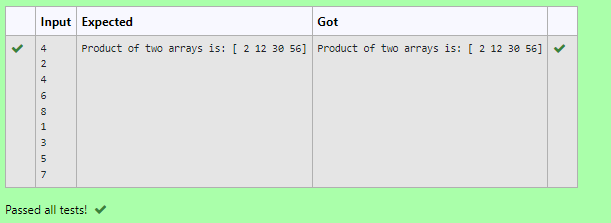

# Multiplying-two-matrix

## AIM:
Write a python program to multiply two arrays using numpy

## ALGORITHM:
### Step 1:
Import numpy library using import statement.
### Step 2:
Create two empty lists and use input() method to find the number of elements to add in each list.
### Step 3:
Initiate a for loop and add elements to the list using input() and append() method.
### Step 4:
Create a 3rd empty list and append the product of each element in the first two lists as its elements.
### Step 5:
Convert the final 3rd list to an array using np.array() method and display the result.

## PROGRAM: 
```
'''
Program to multiply two arrays using numpy
Developed by: Vishranthi.A
RegisterNumber: 21003066
'''
import numpy as np
l1, l2 = [],[]
n= int(input())
for i in range(n):
    l1.append(int(input()))
for i in range(n):
    l2.append(int(input()))
value1= np.array(l1)
value2 = np.array(l2)
result = value1*value2
print("Product of two arrays is:",result)
```

## OUTPUT:


## RESULT:
Thus the python program to multiply two arrays using numpy is successfully executed.
